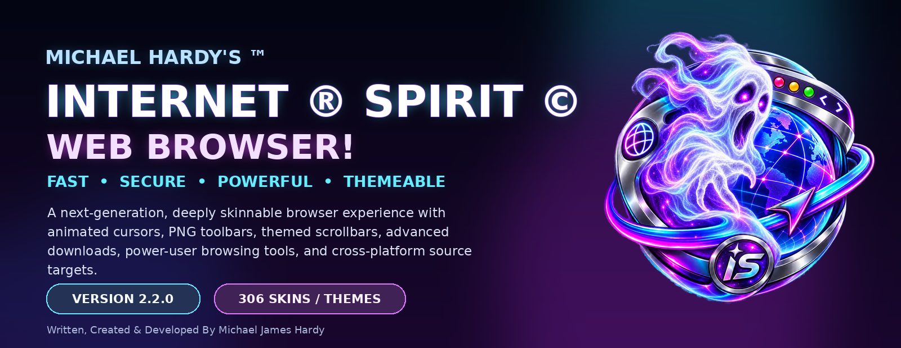
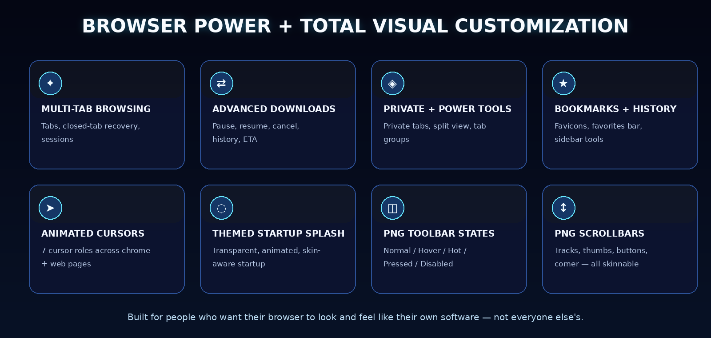
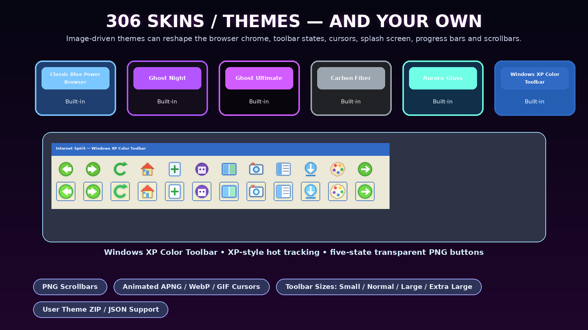
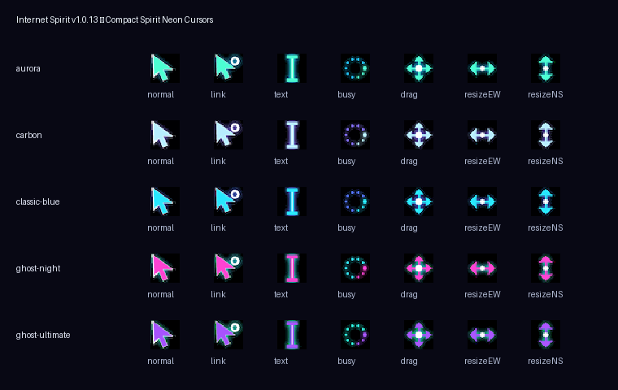
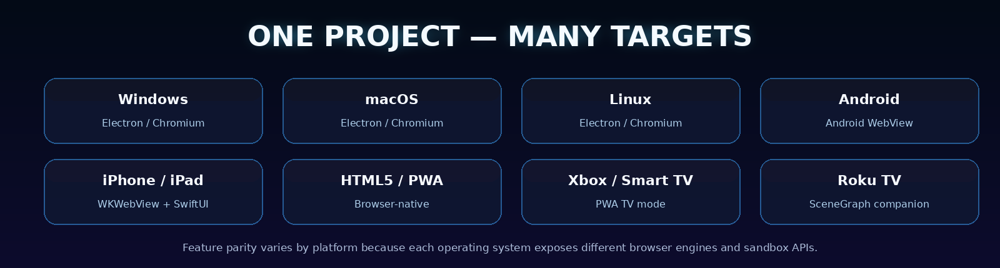
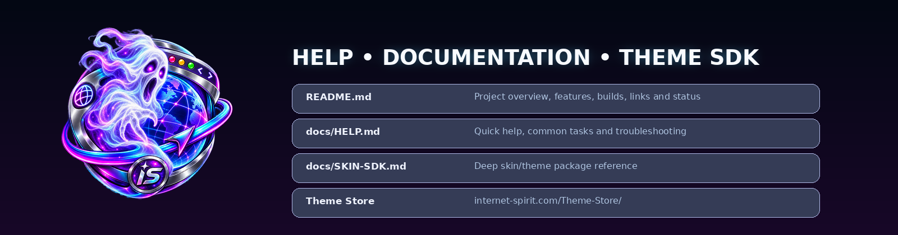
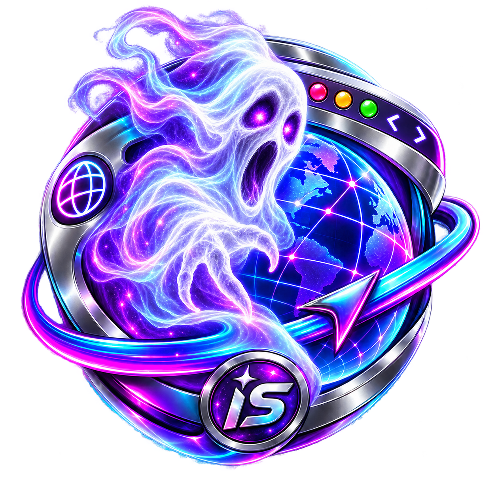

<p align="center">
  
</p>

<h1 align="center">Michael Hardy's ™ Internet ® Spirit © Web Browser!</h1>

<p align="center">
  <strong>FAST • SECURE • POWERFUL • THEMEABLE</strong><br>
  A next-generation, power-user web browser built around deep visual customization, animated skins, classic browser ergonomics, and a modern Chromium-based desktop core.
</p>

<p align="center">
  
  
  
  
</p>

<p align="center">
  <a href="https://internet-spirit.com/"><strong>Official Web Site</strong></a>
  &nbsp;•&nbsp;
  <a href="https://internet-spirit.com/Theme-Store/"><strong>® Skin / Theme © Store Marketplace</strong></a>
  &nbsp;•&nbsp;
  <a href="https://apps.microsoft.com/search/publisher?name=%C2%AENightWare+%C2%A9Studios%21++-++%28+Michael+Hardy+%29"><strong>Michael Hardy's Products on the Microsoft ® Windows App Store!</strong></a>
</p>

---

## 👻 What Is Internet Spirit?

**Michael Hardy's ™ Internet ® Spirit © Web Browser!** is an advanced skinnable browser project designed for users who want far more control over the browser interface than a typical modern browser provides.

Internet Spirit combines a **Chromium/Electron desktop browsing engine** with a highly customizable browser shell: tabs, omnibox browsing, bookmarks, history, sessions, downloads, private browsing, split views, tab groups, mouse gestures, security-verification controls, custom title bars, themed dialogs, animated cursors, image-driven toolbar states, transparent startup splash screens, and a full skin/theme system.

The project also includes cross-platform source targets for **Windows, macOS, Linux, Android, Android TV, iPhone/iPad, HTML5/PWA, Xbox/Smart-TV web mode, and Roku TV companion/portal builds**. Platform capabilities are not identical because each operating system exposes different browser engines and sandbox APIs.

<p align="center">
  
</p>

---

## ✨ Major Features

### 🌐 Browser Core

- Multi-tab browsing with page titles and website favicons.
- Address/search omnibox with configurable search behavior.
- New-tab launcher / speed-dial experience.
- Back, Forward, Reload, Stop, Home, New Tab, Private Tab, and navigation controls.
- Duplicate, reopen, close, and recover recently closed tabs.
- Redirect supported new-window requests into browser tabs.
- Zoom controls, Find in Page, Full Screen, and Developer Tools.
- External protocol handling for supported operating-system links.
- Link-target preview in the status area.
- Persistent browser partition and local browser settings.

### 🧭 Power-User Interface

- Classic menu strip plus modern toolbar controls.
- Scrollable tab strip.
- Favorites / bookmarks bar.
- Sidebar tool center for Bookmarks, History, Downloads, Sessions, Skins, and related utilities.
- Private browsing support.
- Tab groups and split-view controls.
- Mouse-gesture support.
- Search Engine Manager.
- Toolbar Designer.
- Website screenshot/capture controls.
- Session restore and closed-tab recovery.
- Custom frameless title bar with fully themed window controls.

### 📥 Advanced Download Manager

- Persistent download history.
- Live filename, source host, received bytes, total bytes, speed, ETA, and state.
- Pause, Resume, and Cancel for active Electron downloads.
- Open File and Show in Folder actions.
- Delete completed download files.
- Pause All, Resume All, Clear Completed, search, and state filters.
- Themed progress bars driven by the active skin.

### 🛡️ Privacy, Control & Security Features

- Basic ad/tracker URL-blocking control.
- Private browsing tabs.
- Dedicated persistent browser partition.
- Host renderer uses context isolation with no Node integration in page content.
- Security-verification compatibility controls.
- Reset command for difficult verification sessions.
- Custom right-click editing/context menus for browser fields and web content.
- Spelling suggestions and Inspect Element support in the context menu where available.

> [!IMPORTANT]
> Internet Spirit is a powerful development browser foundation. A production browser distributed to untrusted users should receive dedicated security review, stay current with Chromium/Electron security releases, and carefully harden permissions, protocol handling, downloads, navigation, and update delivery.

---

## 🎨 306 Skins / Themes — Plus User-Made Themes

<p align="center">
  
</p>

Internet Spirit v2.2.0 contains **306 total skin/theme folders** in the complete assembled package:

| Built-In Skin | Style |
|---|---|
| **Classic Blue Power Browser** | Classic blue power-browser appearance |
| **Ghost Night** | Dark neon ghost theme |
| **Ghost Ultimate** | Deep purple premium-style ghost chrome |
| **Carbon Fiber** | Dark carbon / metallic look |
| **Aurora Glass** | Bright glass / aurora styling |
| **Windows XP Color Toolbar** | Colorful classic toolbar with XP-style hot tracking |

The remaining **300 generated themes** expand the library with additional graphic styles and visual combinations.

### Five-State Transparent PNG Toolbar Engine

Every upgraded theme can provide separate transparent PNG artwork for each toolbar control state:

```text
normal.png
hover.png
hot.png
pressed.png
disabled.png
```

If a user-made theme omits one of the alternate states, Internet Spirit can fall back to the Normal artwork.

### Four Toolbar Sizes

Users can select the toolbar size from Browser Options or the View menu:

```text
Small
Normal
Large
Extra Large
```

**Large** is the default in the current v2.2.0 theme configuration.

### Windows XP-Style Hot Tracking

The **Windows XP Color Toolbar** skin adds colorful classic browser buttons and XP-inspired hover/hot behavior. Theme manifests can request:

```json
{
  "toolbarDefaults": {
    "effectStyle": "windows-xp"
  }
}
```

The UI also supports effect-style choices such as **Skin Defined**, **Windows XP Classic**, and **Image States Only**.

---

## 🖱️ Animated Cursor Engine

<p align="center">
  
</p>

Internet Spirit can render animated skin cursors over both the browser chrome and embedded web content.

Supported cursor roles include:

- **Normal**
- **Link / Hand**
- **Text / I-Beam**
- **Busy / Progress**
- **Drag / Move**
- **Horizontal Resize**
- **Vertical Resize**

Supported artwork can include **APNG, animated WebP, GIF, or explicit PNG/WebP frame sequences**.

### Native Pointer / Hand Suppression

Beginning with v2.2.0, when animated skin cursors are enabled, Internet Spirit suppresses the regular operating-system pointer/hand so the themed animated cursor is the visible pointer. Cursor suppression is also injected into guest frames and supported cross-origin iframe controls.

Users can disable animated skin cursors at any time to restore ordinary system/CSS cursor behavior.

---

## ↕️ PNG-Skinnable Scrollbars

Internet Spirit v2.2.0 adds a complete image-driven scrollbar skin system. A theme can replace:

```text
track-vertical.png
track-horizontal.png
thumb-vertical-normal.png
thumb-vertical-hover.png
thumb-vertical-active.png
thumb-horizontal-normal.png
thumb-horizontal-hover.png
thumb-horizontal-active.png
button-up.png
button-down.png
button-left.png
button-right.png
corner.png
```

The active scrollbar artwork can also be injected into supported guest web-content frames, allowing the browser chrome and page scrollbars to share the same theme identity.

---

## 🚀 Themed Transparent Startup Splash Screen

The startup experience is skin-aware and supports a **frameless transparent splash screen** with real startup progress.

Themes can customize splash variables and can optionally include a dedicated:

```text
splash.css
```

A custom splash can use local PNG, WebP, GIF, gradients, CSS effects, and image-driven progress artwork. Users can disable the splash or choose display timing such as **Fast**, **Normal**, **Showcase**, or **Extended**.

---

## 🧩 User-Made Theme Support

Desktop themes may be installed from a folder or ZIP package. A normal user theme contains:

```text
MyInternetSpiritTheme/
├── skin.json
├── skin.css                 # optional
└── assets/
    ├── toolbar-states/
    ├── cursors/
    ├── scrollbars/
    ├── splash-background.png
    └── other-theme-artwork.png
```

On Windows desktop builds, the browser creates a user-skin location beneath the Electron user-data folder, for example:

```text
%APPDATA%\Michael Hardy's ™ Internet Spirit Web Browser!®\skins
```

For deeper theme-authoring details, see **[`docs/SKIN-SDK.md`](docs/SKIN-SDK.md)** and the included cross-platform user-theme template.

### Theme Store

Browse additional themes here:

**https://internet-spirit.com/Theme-Store/**

---

## 🖥️ Cross-Platform Source Targets

<p align="center">
  
</p>

| Platform | Project Edition | Engine / UI |
|---|---|---|
| **Windows** | Full Desktop | Electron / Chromium |
| **macOS** | Full Desktop | Electron / Chromium |
| **Linux** | Full Desktop | Electron / Chromium |
| **Android** | Native Mobile | Android WebView |
| **Android TV** | Native TV | Android WebView + Leanback launcher |
| **iPhone / iPad** | Native Apple Mobile | WKWebView + SwiftUI |
| **HTML5 / PWA** | Web Edition | Browser-native HTML/CSS/JavaScript |
| **Xbox / Smart TV** | Web / TV Mode | PWA 10-foot interface |
| **Roku TV** | Companion / Portal | SceneGraph + BrightScript |

The shared theme format carries common colors, settings, artwork, bookmarks, and toolbar concepts across platform targets. Desktop and PWA can expose all five toolbar states directly; mobile and TV targets map hover/hot/pressed states to the interactions their platforms support.

---

## 💻 System Requirements

### Desktop End Users — Practical Recommendations

| Component | Recommendation |
|---|---|
| **Windows** | Windows 10 or Windows 11; 64-bit recommended |
| **macOS** | Modern Intel or Apple Silicon Mac supported by the Electron build being used |
| **Linux** | Modern 64-bit desktop distribution with an Electron/Chromium-compatible X11 or Wayland session |
| **Memory** | 4 GB practical minimum; 8 GB or more recommended for multi-tab browsing |
| **Graphics** | Modern graphics driver capable of Chromium/Electron acceleration |
| **Storage** | Allow space for the application, Chromium cache, downloads, user data, and the theme library |
| **Internet** | Required for normal web browsing and online store/website services |

### Web / PWA

- Current modern browser with JavaScript enabled.
- Local Storage / IndexedDB available for persistent settings and user-theme data.
- Installable-PWA support depends on the host browser and operating system.

### Android / Android TV Source

The current Android project is configured with:

```text
minSdk:     24
compileSdk: 36
targetSdk:  36
```

Open `cross-platform/android` in Android Studio after preparing the shared themes.

### Developer / Build Workstation

- Node.js and npm compatible with the project's Electron 43.x toolchain.
- Electron **43.4.0** through the project dependencies.
- electron-builder **26.x** for desktop packaging.
- Windows build environment for NSIS / Portable Windows output.
- macOS build environment for normal Apple signing/notarization workflows.
- Linux build environment for AppImage / DEB packaging.
- Android Studio / Android SDK for Android and Android TV.
- Xcode on macOS for iPhone / iPad native source work.
- Roku developer environment/device access for Roku sideload testing.

---

## ⚡ Quick Start — Desktop

### 1. Install Dependencies

```bash
npm install
```

### 2. Start Internet Spirit

```bash
npm start
```

### 3. Development Launch

```bash
npm run dev
```

---

## 🏗️ Build Commands

### Windows

```bash
npm run dist:win
```

Windows targets include an **NSIS installer** and **Portable** build. The Windows executable name is:

```text
Internet Spirit.exe
```

### macOS

```bash
npm run dist:mac
```

Configured output targets include DMG and ZIP.

### Linux

```bash
npm run dist:linux
```

Configured output targets include AppImage and DEB.

### HTML5 / PWA

```bash
npm run build:web
```

To serve the generated web build locally:

```bash
npm run serve:web
```

### Prepare Shared Themes for Cross-Platform Projects

```bash
npm run prepare:cross
```

This prepares/copies the shared theme library for native platform projects where required.

---

## 📦 v2.2.0 Split Source Package

The large source release can be distributed as a split download. Place all files in the same folder:

```text
Internet_Spirit_v2.2.0_CORE_SOURCE.zip
Internet_Spirit_v2.2.0_THEMES_PART_1_of_4.zip
Internet_Spirit_v2.2.0_THEMES_PART_2_of_4.zip
Internet_Spirit_v2.2.0_THEMES_PART_3_of_4.zip
Internet_Spirit_v2.2.0_THEMES_PART_4_of_4.zip
ASSEMBLE-INTERNET-SPIRIT-v2.2.0.bat
```

Run:

```text
ASSEMBLE-INTERNET-SPIRIT-v2.2.0.bat
```

The assembler verifies the source and expects **306 theme folders**.

`dist-web` is intentionally omitted from the split source because it duplicates the complete theme library. Rebuild it after assembly with:

```bash
npm run build:web
```

---

## 📁 Project Layout

```text
InternetSpiritWebBrowser/
├── build/                       # Application icon / packaging artwork
├── cross-platform/
│   ├── android/                 # Android + Android TV source
│   ├── ios/                     # iPhone / iPad source
│   ├── shared/                  # Portable theme schema and shared assets
│   ├── tv/                      # PWA / TV guidance
│   └── user-theme-template/     # Ready-to-edit user theme
├── docs/
│   ├── HELP.md                  # GitHub-friendly help file
│   └── SKIN-SDK.md              # Skin/theme SDK reference
├── src/
│   ├── renderer/                # Main browser UI
│   ├── skins/                   # Built-in + assembled theme collection
│   ├── main.js                  # Electron main process
│   ├── preload.js               # Secure preload bridge
│   └── guest-preload.js         # Embedded web-content integration
├── tools/                       # Cross-platform / web build tools
├── FEATURES.md                  # Feature matrix
├── README.md                    # This file
└── package.json                 # Build scripts and package metadata
```

---

## ❓ Help & Documentation

<p align="center">
  
</p>

Start here:

- **[`docs/HELP.md`](docs/HELP.md)** — quick help, controls, theme installation, downloads, common problems, and troubleshooting.
- **[`docs/SKIN-SDK.md`](docs/SKIN-SDK.md)** — complete skin/theme package guide.
- **[`FEATURES.md`](FEATURES.md)** — compact feature matrix.
- **`RELEASE-NOTES-v2.2.0-XP-COLOR-SCROLLBARS-LINKS-CURSOR.md`** — current v2.2.0 release notes.
- **`cross-platform/PLATFORM-MATRIX.md`** — platform architecture reference.
- **`cross-platform/user-theme-template/`** — starting point for a custom theme.

---

## 🛠️ Common Troubleshooting

### The browser opens but a theme looks incomplete

A user theme may omit optional image states or assets. Internet Spirit is designed to use sensible fallbacks where possible. Verify the paths in `skin.json`, confirm the assets exist, then reload/reapply the skin.

### The animated cursor appears together with the normal pointer

Use v2.2.0 or newer. v2.2.0 adds native pointer/hand suppression while animated cursors are active and extends suppression into guest frames.

### The animated cursor is too large or too small

Open Browser Options and choose the cursor scaling option that best matches your display. Built-in compact cursor artwork is designed around smaller cursor sizes.

### Scrollbars do not match my theme

Check the theme's `scrollbars` manifest block and confirm all referenced PNG files exist. Thumb images can provide Normal, Hover, and Active states.

### Windows security verification keeps repeating

Use Internet Spirit's security-verification reset command to clear the browser session state used by the compatibility flow, then reload the site.

### The HTML5/PWA build is missing most themes

After assembling the complete split source package, run:

```bash
npm run build:web
```

The generated `dist-web` folder is intentionally not included in the split package.

---

## 🔗 Official Links

### Official Web Site

**https://internet-spirit.com/**

### ® Skin / Theme © Store Marketplace

**https://internet-spirit.com/Theme-Store/**

### Michael Hardy's Products on the Microsoft ® Windows App Store!

Web fallback:

**https://apps.microsoft.com/search/publisher?name=%C2%AENightWare+%C2%A9Studios%21++-++%28+Michael+Hardy+%29**

Windows Store protocol:

```text
ms-windows-store://publisher/?name=®NightWare ©Studios!  -  ( Michael Hardy )
```

---

## 👨‍💻 Author & Credits

**Written, Created & Developed By Michael James Hardy**

**®NightW@re ©Studios!  -  ( Michael Hardy )**

Internet Spirit is built around the idea that a browser should be more than a blank frame around web pages. It should have personality, graphics, motion, customization, practical power-user tools, and the freedom for users to make the interface their own.

---

## 📜 Version

```text
Product:      Michael Hardy's ™ Internet ® Spirit © Web Browser!
Version:      2.2.0
Windows EXE:  Internet Spirit.exe
Theme Count:  306 complete assembled themes/skins
Desktop Core: Electron / Chromium
```

---

## 📄 License

The current source package declares the project code under the **MIT License** in `package.json`.

Project branding, names, logos, artwork, theme artwork, and third-party assets may have their own ownership or redistribution requirements. Review those assets before repackaging or redistributing them separately from the source project.

---

<p align="center">
  
</p>

<h3 align="center">MICHAEL HARDY'S ™ INTERNET ® SPIRIT © WEB BROWSER!</h3>
<p align="center"><strong>Browse the web. Haunt the ordinary. Make the browser yours.</strong></p>
