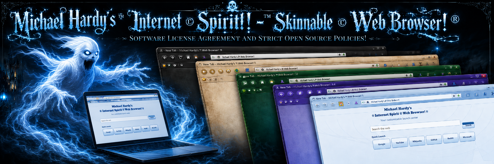

# Michael Hardy's Software License Agreement

## End-User License Agreement (EULA) + Strict Source Code License


<p align="center">
  
</p>

<p align="center">
<strong>Written, Created & Developed by Michael James Hardy</strong><br>
Copyright © 2026–2027 Michael James Hardy. All Rights Reserved.
</p>

> **IMPORTANT:** This repository may contain multiple categories of licensed material. The compiled application, proprietary source code, user interface, artwork, logos, icons, skins, themes, graphics, branding, documentation, and other creative assets are **NOT automatically open source merely because they are visible in a public repository**.
>
> Certain specifically identified source-code files may be released under the **Michael Hardy Strict Source Code License** below.
>
> Unless expressly stated otherwise, all other material remains **Copyright © 2026–2027 Michael James Hardy. All Rights Reserved.**

---

# SECTION I — END-USER LICENSE AGREEMENT (EULA)

## 1. Agreement

This End-User License Agreement ("EULA") is a legal agreement between the person or organization using the software ("User", "you", or "your") and **Michael James Hardy** ("Licensor", "Author", or "Developer").

By downloading, installing, accessing, executing, copying, or using software distributed under this EULA, you acknowledge that you have read, understood, and agreed to these terms.

If you do not agree, you must not install, execute, copy, distribute, or use the software.

---

## 2. License Grant

Subject to compliance with this EULA, Michael James Hardy grants you a limited, revocable, non-exclusive, non-transferable license to:

* install and use an authorized copy of the software;
* use the software for its intended lawful purposes;
* create reasonable backup copies;
* use features and components intentionally included with the software; and
* use the software on supported systems and devices.

No ownership interest is transferred to you.

---

## 3. Ownership and Copyright

The software and its associated intellectual property remain the property of Michael James Hardy and/or their respective third-party rights holders.

Unless a file expressly contains another license, all rights are reserved.

Protected material includes, without limitation:

* application source code;
* compiled binaries;
* executables;
* UI layouts;
* windows and dialogs;
* toolbar designs;
* menu systems;
* logos;
* application icons;
* file-association icons;
* toolbar and menu icons;
* artwork;
* splash screens;
* skins;
* themes;
* theme packages;
* theme previews;
* backgrounds;
* animations;
* custom cursors;
* documentation;
* help files;
* installers;
* website assets;
* promotional artwork; and
* other original creative material.

### Copyright

**Copyright © 2026–2027 Michael James Hardy. All Rights Reserved.**

---

## 4. Restrictions

Unless separately authorized in writing, you may not:

1. sell, rent, lease, sublicense, or commercially redistribute the proprietary software;
2. falsely claim authorship or ownership;
3. remove or alter copyright, license, credit, or attribution notices;
4. represent an unofficial or modified build as an official Michael Hardy release;
5. repackage the software under another publisher's name while retaining protected Michael Hardy assets;
6. copy protected artwork into another application;
7. commercially exploit protected logos, icons, skins, themes, or other assets without permission;
8. bypass licensing, activation, premium, registration, or trial restrictions;
9. distribute unauthorized activation keys, cracks, loaders, or licensing bypasses;
10. use the software or its branding to deceive or impersonate;
11. redistribute maliciously modified builds; or
12. use the software in violation of applicable law.

---

## 5. Reserved UI, Artwork, Logos, Icons, Skins and Themes

The following materials are expressly excluded from any source-code permission unless a specific written license states otherwise:

* **User Interface artwork**
* **Logos**
* **Application icons**
* **File-association icons**
* **Toolbar icons**
* **Menu icons**
* **Splash-screen artwork**
* **Ghost/spirit artwork**
* **Skins**
* **Themes**
* **Theme graphics**
* **Theme previews**
* **Background images**
* **Custom cursors**
* **Installer artwork**
* **Promotional graphics**
* **Marketing screenshots**
* **Website artwork**
* **Product branding**
* **Studio/company branding**
* **Documentation artwork**

These assets remain:

> **Copyright © 2026–2027 Michael James Hardy. All Rights Reserved.**

Possession of source code does not grant permission to extract, reuse, modify, sell, sublicense, redistribute, or commercially exploit these assets.

---

## 6. Third-Party Components

The software may include or depend upon third-party libraries, SDKs, frameworks, runtimes, codecs, engines, fonts, packages, or other components.

Those components remain governed by their respective licenses.

Nothing in this EULA is intended to override rights granted under legitimate third-party licenses such as MIT, BSD, Apache, MPL, LGPL, GPL, or similar licenses.

---

## 7. Warranty Disclaimer

TO THE MAXIMUM EXTENT PERMITTED BY LAW, THE SOFTWARE IS PROVIDED **"AS IS"** AND **"AS AVAILABLE"**, WITHOUT WARRANTIES OF ANY KIND.

MICHAEL JAMES HARDY DISCLAIMS ALL WARRANTIES THAT MAY LEGALLY BE DISCLAIMED, INCLUDING WARRANTIES OF MERCHANTABILITY, FITNESS FOR A PARTICULAR PURPOSE, NON-INFRINGEMENT, RELIABILITY, SECURITY, OR ERROR-FREE OPERATION.

Users are responsible for maintaining appropriate backups and determining whether the software is suitable for their intended purpose.

---

## 8. Limitation of Liability

TO THE MAXIMUM EXTENT PERMITTED BY LAW, MICHAEL JAMES HARDY SHALL NOT BE LIABLE FOR INDIRECT, INCIDENTAL, SPECIAL, CONSEQUENTIAL, EXEMPLARY, OR PUNITIVE DAMAGES ARISING FROM THE USE OR INABILITY TO USE THE SOFTWARE.

This includes, without limitation, loss of data, business interruption, lost profits, system damage, or loss of use.

---

## 9. Termination

Rights granted under this EULA terminate upon material violation of its terms.

Following termination, the violating party must cease exercising rights dependent upon this license.

Copyright, ownership, attribution, reserved-assets, warranty, liability, and enforcement provisions survive termination where legally applicable.

---

# SECTION II — STRICT SOURCE CODE LICENSE

## Michael Hardy Strict Source Code License

Certain portions of Michael Hardy's source code may be publicly released for education, study, debugging, interoperability, experimentation, modification, and community development.

**Publicly visible source code does not mean every part of the project is freely reusable.**

Because this license reserves commercial, branding, asset, and redistribution rights, it should be regarded as a **strict source-available license with limited open-source-style permissions**, rather than an OSI-approved open-source license unless Michael James Hardy separately designates particular components under an OSI-approved license.

---

## 10. Covered Source Code

Source code is covered by this license only when:

* the file contains a notice stating that this license applies;
* a repository document expressly lists the file or directory;
* a `LICENSE`, `NOTICE`, or similar document identifies it as covered; or
* Michael James Hardy expressly grants permission in writing.

Files not expressly licensed remain **All Rights Reserved** unless another valid license applies.

### Recommended Source Header

```text
Copyright © 2026-2027 Michael James Hardy.

This source file is licensed under the Michael Hardy
Strict Source Code License contained in EULA.md.

UI artwork, logos, icons, skins, themes, branding,
splash screens and other reserved assets are NOT
included unless expressly stated otherwise.
```

---

## 11. Permitted Uses

Covered source code may be:

* viewed and studied;
* compiled for personal testing;
* modified for personal use;
* modified for educational purposes;
* used for legitimate research;
* used for debugging;
* used for interoperability development;
* used for accessibility improvements;
* used for security review;
* submitted as a patch or pull request; and
* redistributed in modified source form when all conditions of this license are satisfied.

These rights apply only to covered source code.

---

## 12. Source-Code Restrictions

Without separate written permission from Michael James Hardy, covered code may not be used to:

* sell substantially derived commercial software;
* sell a rebranded copy of the original application;
* sell access to unauthorized modified builds;
* claim ownership of Michael Hardy's original work;
* remove author or copyright notices;
* falsely claim a fork is an official release;
* reuse official logos, icons, skins, themes, artwork, or branding;
* bypass premium, activation, registration, or trial functionality;
* produce or distribute cracks, unauthorized product keys, or activation bypasses;
* distribute malware, spyware, credential stealers, ransomware, or destructive software;
* deceive users concerning the original author or publisher; or
* violate third-party licenses.

---

## 13. Required Attribution

Any permitted public redistribution must retain prominent attribution.

At minimum:

> **Original software/source code written, created and developed by Michael James Hardy.**
> **Copyright © 2026–2027 Michael James Hardy.**
> **Licensed portions used under the Michael Hardy Strict Source Code License.**

Modified versions must clearly distinguish original work from later modifications.

### Recommended Fork Notice

```text
Based in part on source code by Michael James Hardy.
Copyright © 2026-2027 Michael James Hardy.

Modifications by: [Your Name / Organization]
Modification date: [Date]

This modified version is not an official Michael Hardy
release unless expressly stated otherwise in writing.
```

---

## 14. Redistribution Requirements

Covered source code may be redistributed only when:

1. the applicable license text is included;
2. original copyright notices remain intact;
3. attribution remains intact;
4. modifications are identified;
5. protected artwork and branding are removed unless separately licensed;
6. the fork is not represented as an official release;
7. third-party license requirements are preserved; and
8. no activation or licensing circumvention is included.

Compiled forks must use sufficiently different branding to avoid confusing users into believing that they are official Michael Hardy releases.

---

## 15. Contributions

By submitting a pull request, patch, code contribution, documentation correction, or similar contribution, the contributor represents that they have the legal right to submit it.

Unless otherwise agreed in writing, contributors permit the project to reproduce, modify, merge, publish, distribute, and include their contribution in project releases.

Contributing code does not provide ownership rights over unrelated portions of the project, its branding, artwork, or assets.

---

# RESERVED ASSETS — NOT INCLUDED IN SOURCE LICENSE

| Material              | License Status          |
| --------------------- | ----------------------- |
| UI artwork            | **All Rights Reserved** |
| Logos                 | **All Rights Reserved** |
| Application icons     | **All Rights Reserved** |
| File icons            | **All Rights Reserved** |
| Toolbar icons         | **All Rights Reserved** |
| Skins                 | **All Rights Reserved** |
| Themes                | **All Rights Reserved** |
| Theme artwork         | **All Rights Reserved** |
| Splash screens        | **All Rights Reserved** |
| Ghost/spirit artwork  | **All Rights Reserved** |
| Custom cursors        | **All Rights Reserved** |
| Promotional graphics  | **All Rights Reserved** |
| Product branding      | **All Rights Reserved** |
| Studio branding       | **All Rights Reserved** |
| Installer artwork     | **All Rights Reserved** |
| Documentation artwork | **All Rights Reserved** |

### Copyright © 2026–2027 Michael James Hardy. All Rights Reserved.

Users may create their own replacement themes, artwork, graphics, icons, and branding for an authorized fork, provided those replacements do not infringe the rights of Michael James Hardy or another party.

---

# TRADEMARKS AND BRANDING

No trademark, trade-name, product-name, logo, endorsement, merchandising, or publicity rights are granted merely by receiving source-code rights.

An unofficial fork may not use Michael Hardy branding in a manner that suggests the fork is:

* official;
* approved;
* certified;
* sponsored;
* published; or
* endorsed

by Michael James Hardy.

Unofficial forks should use their own distinctive product name, icon, logo, and visual identity.

---

# FILE-LEVEL AND THIRD-PARTY LICENSES

Individual files may use another license.

If a particular file expressly contains another valid license notice, that file-level license governs that file.

Examples may include:

* MIT License
* BSD License
* Apache License 2.0
* Mozilla Public License
* GNU GPL
* GNU LGPL

Third-party notices must not be removed.

The presence of separately licensed code in a repository does **not** automatically change the license of neighboring proprietary files.

---

# GITHUB LICENSING NOTICE

The following notice may also be added to the main `README.md`:

> ## Licensing
>
> This project uses a mixed licensing model.
>
> Certain specifically identified source-code components are released under the **Michael Hardy Strict Source Code License** described in [`EULA.md`](EULA.md).
>
> **The user interface, logos, icons, artwork, skins, themes, splash screens, branding, promotional graphics, and related visual assets are Copyright © 2026–2027 Michael James Hardy. All Rights Reserved.**
>
> Public availability of source code does not automatically grant permission to reuse copyrighted artwork, branding, UI assets, or proprietary components.

---

# SUGGESTED GITHUB STRUCTURE

```text
/
├── README.md
├── EULA.md
├── LICENSES/
│   ├── THIRD-PARTY-NOTICES.md
│   └── OPEN-SOURCE-COMPONENTS.md
│
├── assets/
│   ├── hardy-software-logo.png
│   ├── hardy-software-banner.png
│   └── license-badge.png
│
├── src/
└── third-party/
```

---

# FINAL COPYRIGHT NOTICE

<p align="center">
<strong>MICHAEL HARDY SOFTWARE</strong><br><br>
Written, Created & Developed by Michael James Hardy<br><br>
<strong>Copyright © 2026–2027 Michael James Hardy.</strong><br>
<strong>All Rights Reserved.</strong>
</p>

---

## Source Code and Artwork Are Separate

Permission to view, compile, modify, or redistribute specifically licensed source code does **not** automatically grant permission to use the original:

**UI • Logos • Icons • Skins • Themes • Artwork • Splash Screens • Branding • Promotional Graphics**

unless those assets are expressly and separately licensed.

---
<p align="center">
  
</p>
**END OF LICENSE**
::: 

